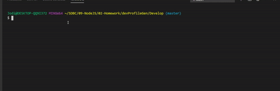
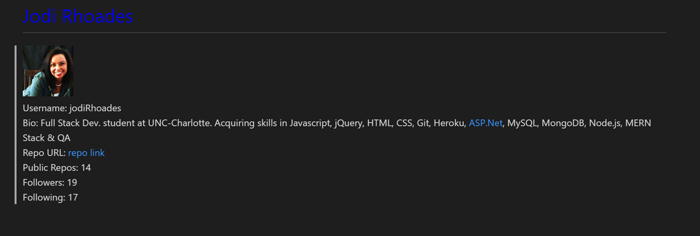

# GitHub Developer Profile Generator

This is a command-line aplication that generates a markdown from the profile information from a GitHub username.  This application is invoked from the following command:  node index.js

Initially the user will be promted for their favorite color which will be used in the font color of their name. 
This markdown will populate the following:

* Profile image
* User name
* Link to User GitHub profile
* location 
* User bio
* Number of public repositories
* Number of followers
* Number of users following

## Business Context

As a product manager

I want a developer profile generator

So that I can easily prepare reports for stakeholders.

When preparing a report for stakeholders, it is important to have up-to-date information about members of the development team. Rather than navigating to each team member's GitHub profile, a command-line application will allow for quick and easy generation of profiles in markdown format.

